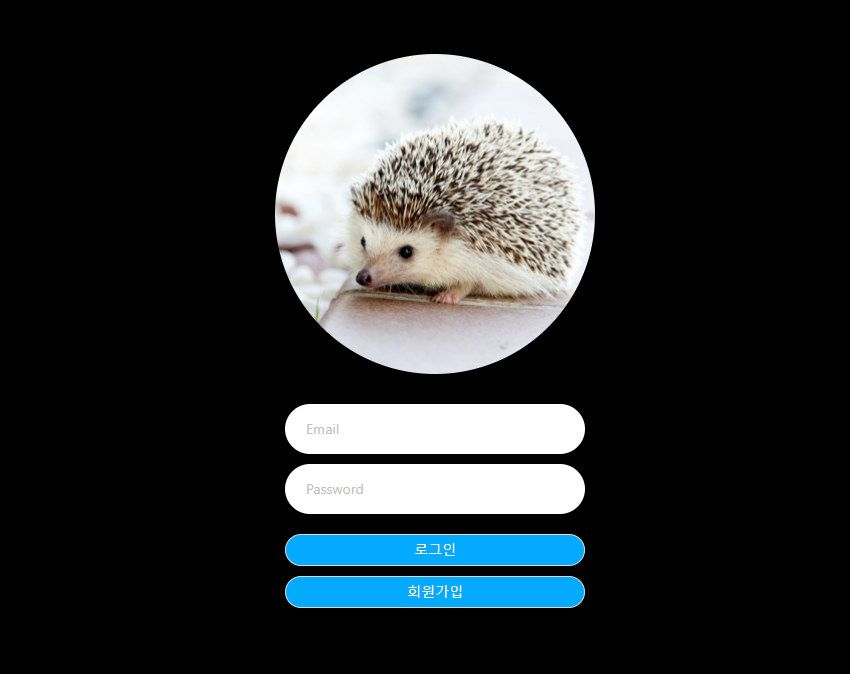
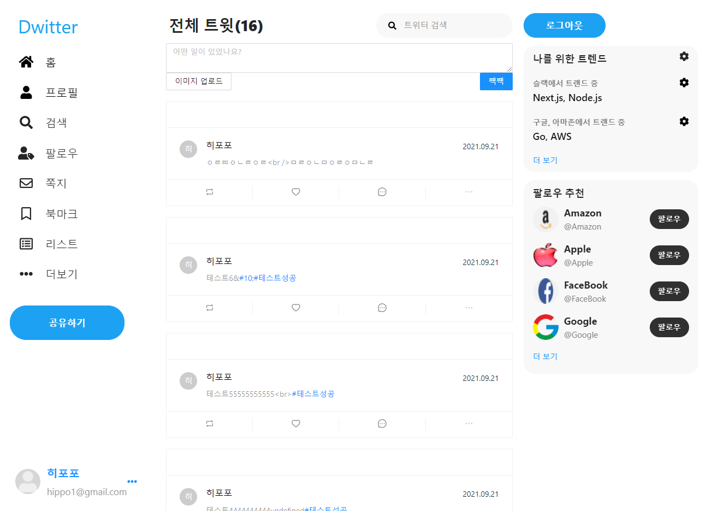

# React_NodeBird

> React.js 와 Node.js 를 이용하여 트위터 만들기

**구현 기능:**

- 로그인(passport), 로그아웃
- 회원가입
- Infinity Scolling
- 게시글 등록, 삭제
- 게시글 상세보기
- Following, Follower 등록 및 차단
- Image Carousel
- HashTag 등록 및 검색
- 게시글 수정

**추가로 구현할 부분:**

- 이미지 Zoom 수정(사진 크기 깨짐)
- passport로 소셜 로그인 구현

#사용한 기술
**Front:**

- ReactJS
- NextJS
- Redux
- Redux-Saga

**Backend:**

- NodeJS
- Express
- Multer
- Sequelize

**DevOps:**

- My-SQL

> ScreenShot

#Login Page
## 로그인 하지 않은 사용자는 자동으로 login페이지로 이동.  

#Index Page  
## 로그인 완료한 사용자에게 보이는 화면.  트윗을 볼 수 있고,  트윗을 쓸 수 있고,  내가 쓴 트윗 수정,  댓글작성

